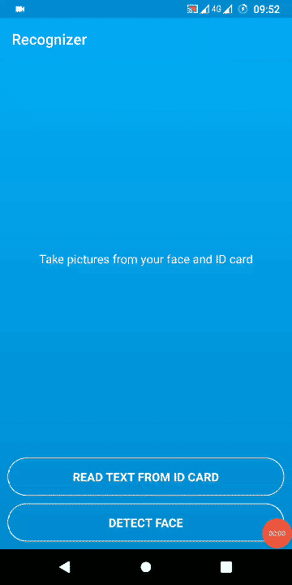

# Recognizer

## Synopsis

Android application with [MLKit](https://developers.google.com/ml-kit) for face and text recognition.

## Requirements

- Two modules: _SDK_ for image processing and _APP_ that consumes SDK
- Take picture of face using front camera and detect if the picture has only one face
- Take picture of card ID using back camera and extract all text found on the picture
- Handle errors (loading camera, taking picture, text or face not found, etc)
- Kotlin coroutines for image processing
- _minSdkVersion_ 21 and latest _targetSdkVersion_
- Unit and integration tests
- Documentation to explain solution

## Download .apk?

[Download APK Link](https://github.com/Leo-Neves/Recognizer/releases/latest)

## Project development

 The first screen of the app is the _MainActivity_ on _APP_ module. This screen has one ImageView and TextView to show the result of the processed face and ID card pictures.

 When clicking on the take picture buttons, _SDK_ should be called. Screens of camera preview belong to _SDK_.

 All the structure of camera and image processing are on _SDK_ module. The communication between _APP_ and _SDK_ is by listeners.

## Frameworks and libraries

- **MLKit:** Google engine to detect faces and text on images. Requires Google Play Services on user device.
- **Coroutines:** Kotlin library to work with asynchronous functions. Instead of MLKit listeners and callbacks, This project use Coroutines
- **Livedata:** Views listen to image processing responses using livedata. Its advantage is being linked to the activity's lifecycle and having its observer removed whenever the activity dies.
- **Espresso:** Used to test activities using its complete lifecycle.
- **Robolectric:** Used to simulate activity lifecycle on unit tests.
- **Mockk:** Used in unit tests to mock functions and classes.
- **Custom Views:** The _SDK_ has two custom views. LoadingButton that agregate a Button with a ProgressBar. CameraOverlayView that draws a shape to helps user on camera focus.
- **Localization:** The application texts are by default in English but have been internationalized to also appear in Portuguese and Estonian (depending on the user's default OS language).

## Architecture
  The MVVM architecture pattern was chosen for this project. The Activity classes have the project's View layer definitions and send commands to the ViewModel layer, which responds to View through changes in the state of LiveDatas. ViewModels make calls to the camera and image processing through UseCase, which are classes used to abstract the interaction with MLKit API for a business rule. Each UseCase has only one function, which contains one piece of image proccessing (one UseCase for load camera, another to take picture, another to process picture to extract text from it, etc).

  UseCases are good to avoid coupling between external MLKit library and own logic of _SDK_ in ViewModels. UsesCases are injected on ViewModels constructor, making it easy for testing.

## In progress
- Show error messages in a Dialog instead of Toast.
- Improve unit tests coverage.
- Draw face parts (mouth, nose, eyes) on detected face.

## Future improvements
- Github actions CI
- Publish on Playstore
- Dependency injection using Koin
- Identify where pictures was taken by latitude and longitude using Google's Geocoding API.